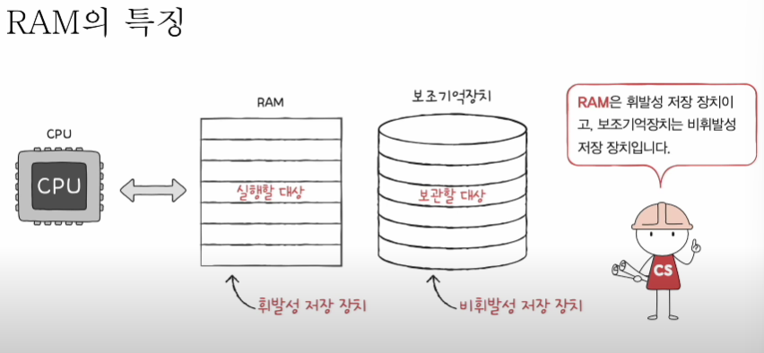
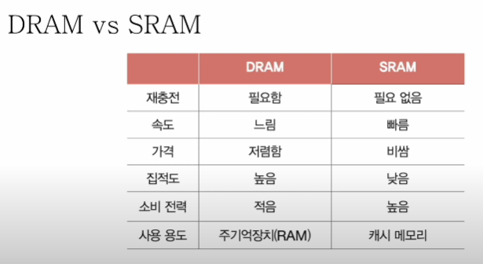

# RAM의 특성과 종류
주 기억장치의 종류에는 RAM, ROM이 있다
 
메모리 라는 용어는 그 중 RAM을 지칭하는 경우가 많다

## RAM의 특징

  - RAM은 실행중인 프로그램을 저장하는 장치
  - 실행중이 아닌 프로그램을 보조기억장치로 부터 가져와 CPU가 실행하는데 도움을 줌
  - RAM의 성능은 CPU의 실행환경에 영향을 줌

## RAM의 종류
- DRAM
  - dynamic RAM
  - 저장된 데이터가 동적으로 사라지는 RAM
  - 데이터 소멸을 막기 위해 주기적으로 재 활성화 해야 함
  - 상대적으로 소비전력이 낮고 저렴
  - 집적도가 높아 대용량으로 설계하기 용이
- SRAM
  - static RAM
  - 저장된 데이터가 정적인(사라지지 않는) RAM
  - DRAM보다 일반적으로 더 빠름
  - 상대적으로 소비전력이 높고 비쌈
  - 집적도가 낮아 대용량으로 설계할 필요는 없지만 빨라야 하는 장치에 사용

- SDRAM
  - synchronous DRAM
  - 특별한(발전된 형태의) RAM
  - 클럭 신호와 동기화 된 DRAM

- DDR SDRAM
  - SDRAM 보다 더 발달된 RAM으로 일반적으로 ddr2 ddr3 라고 부르는 RAM
