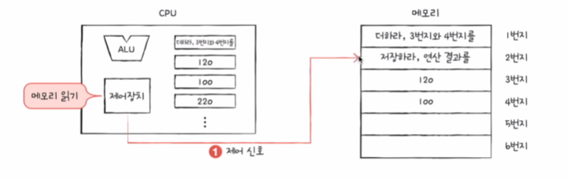

# 컴퓨터의 구조

  

## 컴퓨터가 이해하는 정보

### 데이터
- 숫자, 문자, 이미지, 동영상과 같은 정적인 정보
- 컴퓨터와 주고받는 혹은 내부에 저장된 정보를 데이터라 통칭
- 0과 1로 숫자를 표현하는 방법
- 0과 1로 문자를 표현하는 방법
### 명령어 
- 컴퓨터는 결국 명령어를 처리하는 기계
- 컴퓨터를 실질적으로 움직이는 정보
- 데이터는 명령어를 위한 일종의 재료

## 컴퓨터의 네가지 핵심 부품

### CPU
- CPU의 구성요소
  - ALU(산술 논리 연산 장치) 
    > 일종의 계산기
  - 제어장치
    > CPU 내부의 작은 저장장치
  - 레지스터
    > 제어신호를 받아들이거나 내보내며 명령어를 해석하는 장치
- CPU의 동작 과정
       
### RAM
- 프로그램이 실행되기 위해서는 메모리에 저장되어 있어야 한다
- 메모리는 실행되는 프로그램의 명령어와 데이터를 저장한다
- 메모리에 저장된 값의 위치는 주소로 알 수 있다

### 보조기억장치
- 보관하고장 하는 정보를 저장하는 장치

### 입출력장치
- 일반적으로 컴퓨터 외부에 연결되어 컴퓨터 내부와 정보를 교환할 수 있는 장치