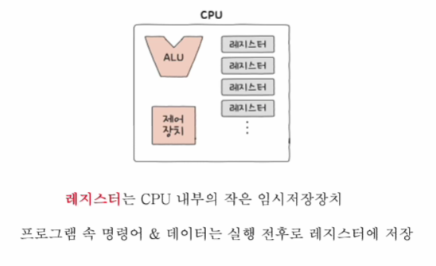

# 레지스터
- 레지스터의 구조

- 레지스터의 종류

    - 프로그램 카운터
        - 메모리에서 가져올 명령어의 주소(메모리에서 읽어 들일 명령어의 주소)
    - 명령어 레지스터
        - 해석할 명령어(방금 메모리에서 읽어 들인 명령어)
    - 메모리 주소 레지스터
        - 메모리의 주소를 저장
    - 메모리 버퍼 레지스터
        - 메모리와 주고받을 값(데이터와 명령어)
    - 플래그 레지스터
        - 연산 결과 또는 CPU 상태에 대한 부가 적인 정보
    - 범용 레지스터
      - 다양하고 일반적인 상황에-자유롭게 사용
    - 스택 포인터
        - 스택의 꼭대기 위치를 가리킴
        - 스택 주소 지정 방식에서 사용
    - 베이스 레지스터
        - 기준이 되는 주소 저장
    - 등등 여러가지 CPU 종류에 따라 종류도 다르다